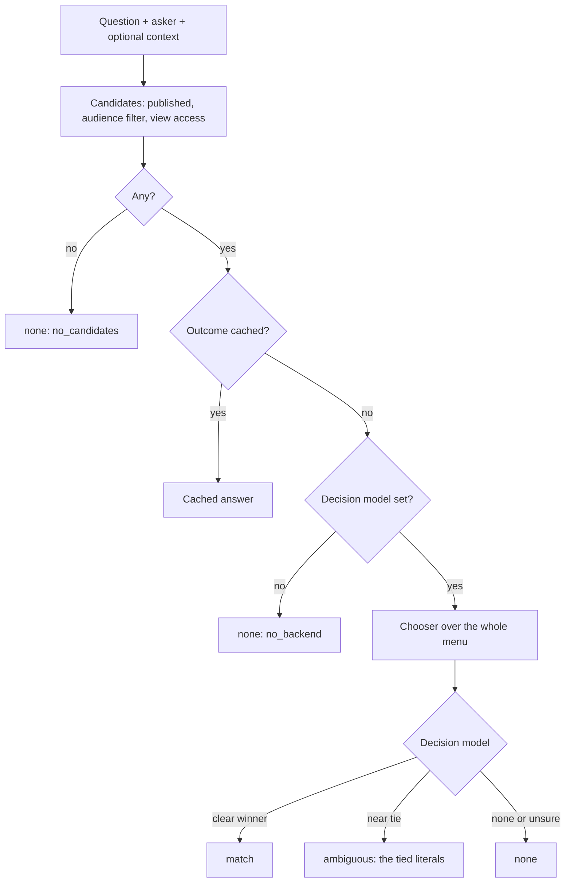

# Literals: how it works, where the models run, and how well

A walkthrough of the `literals` module as built on 2026-10-05 (after Phase 2 and the removal of the embedding gate): what it
stores, the path a question takes, which model is called when, and what
the measurements so far say. Not a decision record: for the reasoning see
[ADR-0040](0040-literals-probabilistic-lookup-of-exact-values.md)
(the current-state rewrite), and for the step-by-step "what do I add when" ladder see
[progressive-enhancement.md](progressive-enhancement.md). Current build
state and open work are in [CLAUDE.md](../CLAUDE.md), [DEVELOPING.md](../DEVELOPING.md) and aim's TODO.md.

## What it is for

A literal is an **exact value** (a phone number, an internal path, a
sentence of policy text) that must never be paraphrased or invented, paired
with a **plain-language description of what it is**, the gist. People and
agents ask in their own words ("how do I ring the library?"); the module's
job is to find the right literal for the question, or say it found none.
The value is read from the row, never generated. The only probabilistic
step is choosing *which* literal; a wrong choice is the failure that
matters, so "no match" is always preferred to a guess.

## The modules

| Module | Needs | Does |
| --- | --- | --- |
| `literals` | `user`, `views` | The entity, types and resolvers, access, the admin UI, `literals.reader`, the `[literal:key]` token. Exact lookup by key. **No model of any kind.** |
| (in `literals`) | none | Plain search (service `literals.search`, used by the tool; the autocomplete route was removed 2026-10-07, nothing used it): every typed word must appear in the name, key or gist; results in name order, for a person or agent to pick from. Access-filtered, published only, never values. No model, no scoring, no `search_api` (a plain entity query; swap in an index if a pool ever needs it). |
| `literals_tool` | `literals`, `tool` | The `literals:lookup` Tool API / MCP tool: by key, by search words (returns candidates), or by question (when `literals_finder` is on). Key beats question beats search. |
| `literals_finder` | `literals`, `drupal/ai` | Lookup by question: the finder, the chooser, the outcome cache, the eval command, and the Guardrails set applied at save. The only part that calls a model. |

A site that only wants a settings store with access control installs the
first and never touches AI.

## What is stored

One content entity, `literal`, revisionable, with a published status. The
bundle is a **type** (a config entity), and the type picks a **resolver**
plugin that decides how the value is validated and read.

| Field | Holds | Seen by a model? |
| --- | --- | --- |
| `name` | Human label, "Main phone number" | No |
| `key` | Machine name, unique across all literals | Yes, as the option ID |
| `gist` | Short description of what the value is | Yes (chooser) |
| `value` | The exact payload, read through its resolver | **Never** |
| `audience` | `anonymous`, `authenticated` or `restricted` | No: used to filter before any model |

Resolvers (`text`, `token`, `entity`, `url`) validate the value on save and
`resolve($account)` it at read time. `entity` and `url` run a view-access
check at read, and a `url` is an internal path only. `$literal->resolve()`
is the one call that turns a literal into a value.

**Access is data on the row.** The `audience` column answers a single
access check and, as a query condition, every list and every finder
lookup. The default is `authenticated`, so a literal whose audience is
forgotten is hidden rather than published. Drafts are visible only to
people who can edit.

**Revisions.** Every field is revisionable, so a gist or value change can
sit as a draft revision until published. Reads serve the published revision
only.

**Config versus content.** Types, settings and the view go through config
sync. Literals themselves are content, editable on production. Settings:
`literals_finder.settings`.

## The path of a question

1. **Candidates.** Published literals with a gist, filtered by the
   asker's audiences in the query and by `access('view')` per entity. This
   runs **before** any model sees anything, so a gist the asker cannot see
   never appears in a prompt or a result.
2. **Outcome cache.** Keyed by the normalized question, the asker's
   audience set, an admin flag, and a fingerprint of everything else that
   decides an outcome (the context, the instructions, the thresholds and the
   decision model), so an answer is never served across permission sets or
   after a setting changes. Tagged `literal_list`, so any literal edit
   clears it. A `none` is cached for 5 minutes only. Errors are never cached.
3. **The chooser.** One Decision API `ChoiceQuestion`: the options are the
   candidates' keys, each described by its gist, plus a `__none__` option.
   The instruction is the optional **context** (who is being asked, for
   example "Questions are put to the website of the Harbourside Community
   Library, so 'you' means the library") followed by the instructions. The
   context is the caller's own if it passes one to `find()`, else the site
   setting `chooser_context`. The model returns a probability per option. If
   `__none__` wins, the answer is `none`. If the winner leads the best
   *other literal* by less than `choice_margin` (0.2), the answer is
   `ambiguous` and the caller gets the tied literals. If the winner is under
   `match_threshold` (0.5), the answer is `none` (`low_confidence`).
   Otherwise `match`.
4. **The caller resolves the value** for its own account. The finder
   returns literals, never values.

The result is always `match`, `ambiguous` or `none`, with the tier that
decided it (`cache`, `chooser` or `pool`) and a reason. A model or network
failure is `none` with reason `error` and a warning in the log, never a
guess.

**Context is a hint, not a filter.** It changes what the model reads "your"
to mean; it does not restrict the pool. Without a context line "what is your
phone number" scored `none` at 0.92 (the model could not tell whose number),
with it `main_phone` at 0.91, while "phone number of the dentist" stayed
`none`. A "bakery" context did not stop the library's only phone matching.

## Where the models are called

| Call | Model | When | What it is sent | Never sent |
| --- | --- | --- | --- | --- |
| Chooser | Decision, hosted Jev | Every uncached question | The question, the context line, and each candidate's key and gist | **Values** |
| Guardrails at save | Deterministic only on the value; the set may add model-backed ones for the gist | At save, with `literals_finder` | The gist; the value only to deterministic guardrails | A value to any model |

No other step calls a model: the access filter, the cache, the reader, the
token and `resolve()` are plain code.

Hosted Jev is a temporary deviation for synthetic or demo data only (see
ADR-0021's 2026-10-02 addendum). The gists and questions go to it, so a real
deployment needs a data-handling decision or a local decision model first.

## Pinned idea: merge a miss into the gist

Not built. When a real question misses (for example "how do I contact you"
against a literal whose gist is "main telephone number"), treat the question
the way consolidation treats a candidate fact: a model proposes a refined
gist ("main telephone contact number"), a verifier checks it is faithful
and still one-intent, and a person approves it before it replaces the gist.
The gist, not a side list, stays the single description. Recorded in
[ADR-0040](0040-literals-probabilistic-lookup-of-exact-values.md).

## Efficacy so far

Measured with `drush literals:eval` over hand-written gold sets. **Treat
these as smoke tests, not benchmarks**: the sets are small, written by the
same hand that tuned the settings, and the context line was written after
seeing the one query it fixed.

| Set | Pool | Answerable hits | Wrong-confident | Unanswerable correct | Time per query |
| --- | --- | --- | --- | --- | --- |
| Seed (`eval/gold.seed.yml`, with "you/your" phrasings) | 9 literals | 29/29 | 0 | 10/10 | 0.3 s |
| Synthetic, near-neighbour heavy (`eval/scale.gen.php.txt`) | 60 | 60/60 | 0 | 10/10 | 0.4 s |
| Synthetic | 234 | 60/60 | 0 | 10/10 (3 repeat runs) | 0.4 s |

Keyword baseline on the seed set (2026-10-06, same 39 queries): the
module's own search (every word must appear) 4/29 hits, 0 wrong, 10/10
nones; a crude variant (filler words dropped, rank by word hits) 17/29 hits,
1 wrong, 2 of 10 false positives. The chooser's lead is paraphrase and
saying none; the same caveats apply (nine literals, one hand).

What the numbers say:

- **Wrong answers were rare; misses and false "found" were the failures.**
  The chooser prefers `none`, the right bias for exact values.
- **The one early miss was a missing input, not model confusion.** "what is
  your phone number" never tied between the phones (the other two scored 0);
  `none` won because "your" named no one. The context line fixed it. Before
  it, on the 234 pool, the chooser picked a plausible but wrong literal for
  two unanswerable questions ("phone number of the dentist", "opening hours
  of the town swimming baths"); the context line removed both. Raising
  `match_threshold` did not help: 0.7 removed one, 0.85 started losing hits.
- **Prompt rewording did not help.** Three versions of the chooser
  instruction were tried before the context line; none beat the default.
- **Pool size did not hurt up to 234.** The full menu works at that size
  with no accuracy loss and about the same latency.

### More runs (2026-10-07 and 2026-10-08, hosted Jev)

Same caveat: none of these is an independent blind set.

| Set | Pool | Answerable hits | Wrong-confident | Unanswerable correct |
| --- | --- | --- | --- | --- |
| Paraphrase (`gold.paraphrase.yml`: synonyms, indirect, typos, terse, verbose) | 9 | 44/45 | 0 | 15/15 |
| Paraphrase | 99 | 44/45 | 0 | 14/15 |
| Seed / blind / new-literals sets | 99 | 28/29, 19/19, 50/51 | 0 | 9/10, 9/11, 6/8 |
| Written by a cold agent from the menu alone (`gold.agentblind.yml`, 45 questions) | 9 | 28/29 | 0 | 13/16 |

- **Repeat runs on one wording were identical**, but a handful of borderline
  queries flipped between sessions; treat a 1-2 query difference as noise.
- **Near-topic questions about someone else** ("reset my bank password",
  "what time does the cafe close") returned our literal. One sentence in
  `chooser_context` (pick a literal for the library's own services, answer
  none if another organization or venue is named) removed all three false
  positives at the cost of 1-2 answerable misses. A softer wording did
  worse; a longer one over-steered.
- **`ALSO` phrases in a gist** ("customer service", "card charges") recovered
  misses with no field or parser; they were written after seeing the
  misses, so the gain is partly in-sample. A wider list ("payments")
  created a false positive: aliases pull near-topic questions in.
- **A bigger pool turns "I don't know" into "the closest thing":** the new
  false positives at 99 literals are mostly gray zone (a catalogue link for
  "gardening books", the accessibility statement for "wheelchair access").
  The agent-written set's remaining false positives are of this kind
  ("how much is the late fee per day" returned the accounts phone).
- **Audience matters to the eval.** Three apparent misses on the agent set
  were correct: `site_name` is authenticated-only and the eval runs as
  anonymous. With `as: 1` on those queries the set scored 28/29.
- **Context can steer the wrong way.** A "library staff asking the IT
  helpdesk" context sent every "you/your" question to none, including "how
  can I call the library", which names the library: the negation over-
  steered. Never a wrong-confident pick in any variant; contexts push
  toward none. Write contexts positively. Per-medium variants are viable
  as a caller's `context`.

### Why there is no embedding gate

A gate (embed the question, compare with stored gist vectors, decide alone
or shortlist) was built and removed on 2026-10-05. Measured against the
chooser alone: identical hits and correct-none at 9 and at 234 literals;
faster at 9 (0.18 s against 0.31 s, 20 of 39 queries answered with no model
call) and not at 234 (0.44 s against 0.41 s, 5 of 70). Without a decision
model it was a shortlister: at margin 0.2, 17 of 29 hits, 12 candidate
lists, no wrong picks, but 3 of 10 unanswerable questions got candidates
instead of `none`; a looser margin picked wrongly. See
[progressive-enhancement.md](progressive-enhancement.md).

## Short answers: scale, safety, no models

**At scale: fine to 234, unknown past it.** The finder sends every visible
literal's key and gist to the chooser on each uncached question, so the
prompt grows with the pool (about 4,000 tokens at 200 literals, estimated).
Repeated questions are served by the outcome cache. If a real pool outgrows
the chooser, measure first; see the ladder.

**Safely: acceptable for the stated scope, with one condition.**
- Values never leave the app. The chooser receives only the question, the
  context and gists; `resolve()` runs afterwards in the caller's own
  account.
- Access is enforced before any model: a literal the asker cannot view is
  not a candidate, so its gist is in no prompt and no result. The outcome
  cache never crosses permission sets.
- The audit log records outcome, tier and IDs, never question text.
- The condition: gists and questions do go to the decision model, and that
  is hosted Jev today. Keep gists free of anything sensitive, use demo data
  only, or use a local decision model.
- A wrong answer is possible (the chooser can pick the wrong literal), so
  anything that must never be wrong should be called by key, not by
  question.

**Without any AI model: yes, by key or by search.** With the built-in search a
person or agent can find a literal by typing words from its name or gist.
That is keyword matching only: "where do I sign in" finds nothing when the
gist says "log in", which the chooser matches. Search lists candidates; it
never decides.

**Without any AI model, by key:** The `literals` module works with no
model and no `drupal/ai`: create, validate, restrict by audience, revision,
list, read through `$literal->resolve()` or `literals.reader`, `[literal:key]`
tokens, and the `literals:lookup` tool by key. By-question lookup needs a
decision model: without one the finder returns `none` with reason
`no_backend` rather than guess.

## What has not been measured

- Pools past 234 literals, and whether the full menu stays viable there.
- A keyword baseline beyond the crude one in the table above (no stemming, no index).
- A second language, and a local decision model (only hosted Jev has run).
- A larger, independently written gold set (an agent-written set exists but shares the model family). The context line and the
  thresholds should be checked on one written blind before they are trusted.
- Live traffic: the real share of questions each tier absorbs, and the real
  miss rate. There is no miss log yet to find out.

## Commands

| Command | Does |
| --- | --- |
| `drush literals:find "question" [--uid=N]` | Runs the finder as a user (default anonymous), prints outcome, tier and keys, never values |
| `drush literals:eval [file]` | Scores a gold set: hit, miss, ambiguous, wrong-confident, unanswerable, time. `expect` may be a key, `none`, `ambiguous` or a list of acceptable answers. Clears the cache first |
