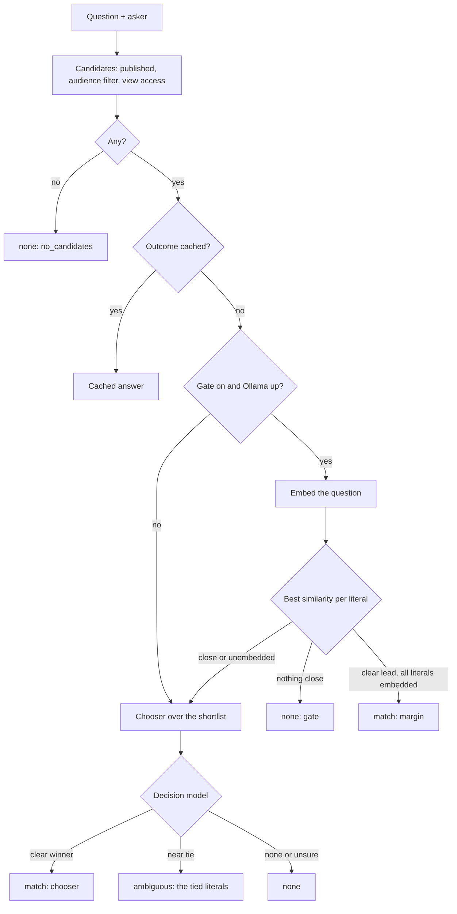

# Literals: how it works, where the models run, and how well

A walkthrough of the `literals` module as built on 2026-10-05: what it
stores, the path a question takes, which model is called when, and what
the measurements so far say. Not a decision record: for the reasoning see
[ADR-0040](../../aim/adr/0040-literals-probabilistic-lookup-of-exact-values.md)
(Addendums 4 to 7), and for the step-by-step "what do I add when" ladder see
[progressive-enhancement.md](progressive-enhancement.md). Current build
state and open work are in [HANDOFF-literals.md](../HANDOFF-literals.md).

## What it is for

A literal is an **exact value** (a phone number, an internal path, a
sentence of policy text) that must never be paraphrased or invented, paired
with a **plain-language description of what it is**, the gist. People and
agents ask in their own words ("how do I ring the library?"); the module's
job is to find the right literal for the question, or say it found none.
The value is read from the row, never generated. The only probabilistic
step is choosing *which* literal; a wrong choice is the failure that
matters, so "no match" is always preferred to a guess.

## The two modules

| Module | Needs | Does |
| --- | --- | --- |
| `literals` | `user`, `views` | The entity, types and resolvers, access, the admin UI. Exact lookup by key. **No model of any kind.** |
| `literals_finder` | `literals`, `drupal/ai` | Lookup by question: the finder, the chooser, the embedding gate, the outcome cache, the eval command. The only part that calls a model. |

A site that only wants a settings store with access control installs the
first and never touches AI. Tokens (`[literal:key]`), the Tool API
`literal_get` and Guardrails at save are Phase 2 and not built yet.

## What is stored

One content entity, `literal`, revisionable, with a published status. The
bundle is a **type** (a config entity), and the type picks a **resolver**
plugin that decides how the value is validated and read.

| Field | Holds | Seen by a model? |
| --- | --- | --- |
| `name` | Human label, "Main phone number" | No |
| `key` | Machine name, unique across all literals | Yes, as the option ID |
| `gist` | Short description of what the value is | Yes (chooser), embedded (gate) |
| `value` | The exact payload, read through its resolver | **Never** |
| `audience` | `anonymous`, `authenticated` or `restricted` | No: used to filter before any model |
| `gist_vector`, `gist_vector_model` | Derived: the gist's embedding as JSON, and the model that made it | No (numbers only) |

Resolvers (`text`, `token`, `entity`, `url`) validate the value on save and
`resolve($account)` it at read time. `entity` and `url` run a view-access
check at read, and a `url` is an internal path only. `$literal->resolve()`
is the one call that turns a literal into a value.

**Access is data on the row.** The `audience` column answers a single
access check and, as a query condition, every list and every finder
lookup. The default is `authenticated`, so a literal whose audience is
forgotten is hidden rather than published. Drafts are visible only to
people who can edit.

**Revisions.** Every field except the vectors is revisionable, so a gist
or value change can sit as a draft revision until published. The
vectors live on the base row and describe the published gist.

**Config versus content.** Types, settings and the view go through config
sync. Literals themselves are content, editable on production. Settings:
`literals_finder.settings`.

## The path of a question

1. **Candidates.** Published literals with a gist, filtered by the
   asker's audiences in the query and by `access('view')` per entity. This
   runs **before** any model sees anything, so a gist the asker cannot see
   never appears in a prompt or a result.
2. **Outcome cache.** Keyed by the normalized question, the asker's
   audience set and an admin flag, so an answer is never served across
   permission sets. Tagged `literal_list`, so any literal edit clears it. A
   `none` is cached for 5 minutes only. Errors are never cached.
3. **The gate** (optional, `gate_enabled`). Embed the question and compare
   with each literal's stored gist vector. Below `gate_min_similarity` (0.55) nothing is close: `none`. A
   lead over the runner-up of at least `gate_margin` (0.2) with every
   candidate embedded: `match`, no chooser call. Otherwise the top 5, plus
   any literal lacking a current vector (queued for embedding), go on.
4. **The chooser.** One Decision API `ChoiceQuestion`: the options are the
   shortlist's keys, each described by its gist, plus a `__none__` option. The model returns a probability per
   option. If `__none__` wins, the answer is `none`. If the winner leads the
   best *other literal* by less than `choice_margin` (0.2), the answer is
   `ambiguous` and the caller gets the tied literals. If the winner is under
   `match_threshold` (0.5), the answer is `none` (`low_confidence`).
   Otherwise `match`.
5. **The caller resolves the value** for its own account. The finder
   returns literals, never values.

The result is always `match`, `ambiguous` or `none`, with the tier that
decided it and a reason. A model or network failure is `none` with reason
`error` and a warning in the log, never a guess; an embedding outage only
drops the gate and falls back to the full menu.

## Where the models are called

| Call | Model | When | What it is sent | Never sent |
| --- | --- | --- | --- | --- |
| Question embedding | Embeddings, local `nomic-embed-text` on Ollama | Gate on, every question that is not an alias pin or a cache hit | The question text | |
| Gist embedding | Same | Once per literal save when the gist changes, when the model changes (queue worker `literals_embed`, `drush literals:embed`) | The gist, each alias | |
| Chooser | Decision, hosted Jev (`jev-latest`) | Only when the gate cannot decide, or the gate is off | The question, and each shortlisted literal's key and gist | **Values** |

No other step calls a model: the access filter, the cache, the cosine compare (PHP) and `resolve()` are all plain code.

Hosted Jev is a temporary deviation for synthetic or demo data only (see
ADR-0021's 2026-10-02 addendum). The gists and questions go to
it, so a real deployment needs a data-handling decision or a local decision
model first. The embedding model is local here, so nothing leaves the
machine at the gate.

## Pinned idea: merge a miss into the gist

Not built. When a real question misses (for example "how do I contact you"
against a literal whose gist is "main telephone number"), treat the question
the way consolidation treats a candidate fact: a model proposes a refined
gist ("main telephone contact number"), a verifier checks it is faithful
and still one-intent, and a person approves it before it replaces the gist.
The gist, not a side list, stays the single description. Recorded as
[ADR-0040 Addendum 8](../../aim/adr/0040-literals-probabilistic-lookup-of-exact-values.md).

## Efficacy so far

Measured with `drush literals:eval` over a hand-written gold set
(`modules/literals_finder/eval/gold.seed.yml`): 24 answerable questions and
6 unanswerable or deliberately vague ones, against 9 synthetic literals
(three phone-like neighbours among them). **Treat these as a smoke test,
not a benchmark**: the set is small, written by the same hand that tuned
the thresholds, and the thresholds were tuned on it.

| Setup | Answerable hits | Wrong-confident | Unanswerable correct | Time per query | Queries with no model call |
| --- | --- | --- | --- | --- | --- |
| Chooser only (full menu) | 23/24 | 0 | 6/6 | 0.30 s | 0 |
| Gate only, placeholder margin 0.1 | 22/24 | 1 | 6/6 | 0.12 s | n/a |
| Gate + chooser, tuned (0.2 / 0.55) | 23/24 | 0 | 6/6 | 0.17 s | 16 of 30 |

What the numbers say:

- **Wrong answers were rare; misses were the common failure.** Across every
  run, the only wrong-confident answer was the untuned gate-only run. The
  chooser prefers `none`, which is the right bias for exact values.
- **The embedding alone cannot separate near neighbours.** Phone-like
  literals sit at leads of 0.01 to 0.15 in cosine similarity; every correct
  answer with a lead of 0.2 or more was right. That is why the margin is
  0.2 and why close pairs go to the chooser. It also cannot tell "email
  address of the librarian" from a phone literal (similarity 0.67): only
  the chooser rejects that.
- **The gate roughly halves the model calls and the latency** at no
  measured accuracy cost on this set (16 of 30 queries answered without
  the chooser).
- **Prompt rewording did not help.** Three versions of the chooser
  instruction were tried; none beat the default, and softer wording turned
  the vague "phone number" into a wrong pick. One version that scored 24/24
  had the test query written into the prompt, so it was discarded as
  contaminated.
- **One miss may be a wrong expectation.** With three phone numbers on the
  site, "what is your phone number" is arguably ambiguous, not clearly the
  main line.

Latency: hosted Jev took about 0.25 to 0.6 s per chooser call here
(consistent with 0.41 s in ADR-0021); a gate-only answer is 0.03 to 0.07 s.
The first query after Ollama idles can take over a second while the model
loads.

## Short answers: scale, safety, no models, more models

**At scale: not known, and one known cost.** Nothing past 9 literals has
been run. The design intent is that the chooser's menu stops growing: the
gate hands it the top 5, so a larger pool should cost more cosine compares,
not a bigger prompt (the full-menu estimate is about 4,000 tokens at 200
literals, unmeasured). But the finder currently loads every visible literal
on each uncached lookup to read its vector, so the work is linear in pool
size and likely to hurt in the low thousands. Repeated questions are served
by the outcome cache. The measurements that would settle it (cosine time at
2,000 and 10,000 vectors, chooser reliability at 50, 200 and 500 options)
are listed below and not done.

**Safely: acceptable for the stated scope, with one condition.**
- Values never leave the app. The chooser and the embedder receive only the
  question and gists; `resolve()` runs afterwards in the caller's own
  account.
- Access is enforced before any model: a literal the asker cannot view is
  not a candidate, so its gist is in no prompt, no embedding comparison and
  no result. The outcome cache never crosses permission sets.
- The audit log records outcome, tier and IDs, never question text.
- The condition: gists and questions do go to the decision model, and that
  is hosted Jev today. Keep gists free of anything sensitive, use demo data
  only, or use a local decision model. The embedder is local, so the gate
  sends nothing out.
- A wrong answer is possible (the chooser can pick the wrong literal), so
  anything that must never be wrong should be called by key, not by
  question.

**Without any AI model: yes, by key only.** The `literals` module works with
no model and no `drupal/ai`: create, validate, restrict by audience,
revision, list, and read through `$literal->resolve()`. Today that read is
PHP-only, because tokens and the `literal_get` tool are Phase 2. By-question
lookup does not work without a model: the finder returns `none` with reason
`no_backend` rather than guess, and there is no keyword fallback built (the
ADR sketches one).

**Better with models, and how.**

| Add | Gains | Measured here |
| --- | --- | --- |
| A decision model (chooser) | Natural-language lookup over the whole pool; refuses rather than guesses | 23/24 answerable, 6/6 unanswerable, 0.30 s per query, 0 wrong-confident |
| An embedding model (gate) | Answers roughly half of questions with no model call, about half the latency; empties the chooser's menu to the top 5 | 16 of 30 queries gated, 0.17 s, same accuracy |
| Neither: gate without a decision model | Possible in code (the margin decides alone) | Not evaluated |
| A vector index (Search API) | Only for thousands of literals | Not built, not needed yet |

The gate is the better value of the two models: cheap, local, and it cuts
both cost and the chance of a wrong pick. It cannot replace the chooser,
because near neighbours (three phone numbers) and off-topic questions that
resemble a literal (an email address versus a phone number) look alike to an
embedding.

## What has not been measured

- Menu sizes of 50, 200 and 500 (the chooser's probability reliability and
  latency at scale), and whether the full menu is still viable there.
- A keyword baseline, to show what the models add over a plain search.
- A second language, and a local decision model (only hosted Jev has run).
- Cosine compare time in PHP at 2,000 and 10,000 vectors.
- A larger, independently written gold set. The thresholds should be
  re-tuned on one before they are trusted.
- Live traffic: the real share of questions each tier absorbs, and the real
  miss rate. There is no miss log yet to find out.

## Commands

| Command | Does |
| --- | --- |
| `drush literals:find "question" [--uid=N]` | Runs the finder as a user (default anonymous), prints outcome, tier and keys, never values |
| `drush literals:eval [file]` | Scores a gold set: hit, miss, ambiguous, wrong-confident, unanswerable, time. Clears the cache first |
| `drush literals:embed` | Embeds every literal whose vectors are missing or from another model |
