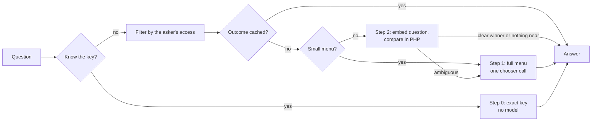

# Literals: running with no model, and what each model adds

Where the `literals` module needs a model, what each step up the ladder
costs, and what it buys. Not a decision record: for the reasoning see
[ADR-0040](../../aim/adr/0040-literals-probabilistic-lookup-of-exact-values.md)
(Addendums 4 and 6 especially) and, for the same kind of accounting on the
sibling module, [model-call-budget.md](../../aim/adr/model-call-budget.md).

The short version: **literals works with no model at all, and nothing is
locked in.** A model is added only at the step where the step before it
stops being enough, and each step is a settings change on top of the
last, not a rewrite.

Terms follow ADR-0040 Addendum 6. The **finder** is the whole lookup (filter
by access, run the cheap steps, return `match`, `ambiguous` or `none`). The
**chooser** is the one model call inside it (a Decision API
`ChoiceQuestion`). The **gate** is the cheap check before the chooser that
decides whether the question is near any literal at all. A **model** here
means a chat, decision or embedding model; "no model" means none of them.

## The ladder

| Step | You ask with | Needs | Model calls per uncached question | Built |
| --- | --- | --- | --- | --- |
| 0. Exact key | A key you already know: a token, `literal_get key=...`, PHP | Nothing beyond `user` and `views` | 0 | Entity, kinds, access: yes. Token and tool: Phase 2, not yet |
| 1. Full menu | A plain-language question | `drupal/ai` and one decision or chat model | 1 (the chooser), 0 on a cache hit | No (Phase 3) |
| 2. Gate, then chooser | A plain-language question | Step 1 plus one embedding model | 1 embedding; the chooser only when the answer is not clear-cut | No (Phase 3) |
| 3. Vector index | A plain-language question, thousands of literals | Step 2 plus `search_api`, `ai_search` and a vector DB provider | 1 embedding; chooser as in step 2 | No, and likely not needed |

Step 0 is a complete product on its own. Set "Home page" to the path
`/node/1`, then place it with `[literal:key]` (Phase 2) or read it with
`$literal->resolve()` today. Nothing in the module's `.info.yml` beyond
`user` and `views`, and nothing in its code calls an AI service. The finder
is a separate piece that is added or left out.

A model-free step 2 alternative exists in the ADR: a full-text top hit with
a margin over the runner-up. It is cheaper to set up and less reliable on
natural-language questions, so it is a fallback, not a rung.

## Where a model is called

| Place | What it does | Needs | When it runs |
| --- | --- | --- | --- |
| Chooser | Picks one literal (or `none`) from key plus gist | Decision model (hosted Jev here), or a chat model | Steps 1 and 2, uncached questions only |
| Question embedding | Turns the question into a vector for the gate | Embedding model (local Ollama here) | Step 2, every uncached question |
| Gist embedding | Stores the gist's vector on the literal row, with the model ID | Embedding model | Step 2, once per save, and again when the model changes |
| Write-time match check | Does the gist describe the value | Decision model, and the only place a value is sent | Optional, at save |
| Guardrails | Checks gist and value text at save | `drupal/ai` Guardrails | Phase 2, at save |

Not model calls: the exact-key lookup, the outcome cache, the access filter,
token replacement and the cosine compare in PHP.

## What is known per call

Only three figures are measured, all from the `aim` side (ADR-0021 and
ADR-0038), and none from literals itself:

| Call | Model | Time | Source |
| --- | --- | --- | --- |
| Typed choice, small prompt | Hosted Jev | 0.41 s including network | ADR-0021, ADR-0038 |
| Typed choice, small prompt | Local `tev1:4b`, CPU only laptop | 10 to 14 s | ADR-0038 |
| Embedding | Local Ollama | Not timed here | Local is the working setup for `aim` recall |

Not measured, and the reason the steps above are not yet a recommendation:

- Whether the Decision API's per-option probabilities stay reliable with
  hundreds of options in one menu. This sets the "show everything" limit.
- Cosine compare time in PHP at 200, 2,000 and 10,000 stored vectors. This
  sets the point where step 3 is needed.
- A menu of 200 gists is estimated at about 4,000 tokens (about 20 per
  gist). That is an estimate, and a static menu can be prompt-cached.
- The share of real questions each tier absorbs. The design pays off only
  if the cheap tiers take most traffic; on a small pool with well-kept
  synonyms a keyword baseline may win everywhere except unanticipated
  phrasing, and then the chooser stays optional (ADR-0040, "Evaluation
  before commitment").

## When to move up a step

| Move | Signal to move | What it adds |
| --- | --- | --- |
| 0 to 1 | Callers arrive with questions, not keys (a chat assistant, a form pre-fill) | A decision or chat model and the finder |
| 1 to 2 | The full menu is too slow or too costly per uncached question, or the model's choice among many options is unreliable | An embedding model and stored vectors; the chooser only for the ambiguous middle |
| 2 to 3 | Compare time in PHP is too slow (likely thousands of literals, unmeasured) | Search API, `ai_search`, a vector DB provider |

Staged choice (group, then literal) is an alternative to step 2 for large
pools that keeps the `drupal/ai`-only dependency, at the price of two
sequential model calls. It is unbuilt and compared in the same
evaluation.

## Data exposure by step

The chooser never receives a value, only each candidate's key and gist
(ADR-0040, "Privacy"). Candidates are filtered by the asker's view access
first, so a gist the asker cannot see is never in any menu.

| Step | Leaves the building | Stays in |
| --- | --- | --- |
| 0 | Nothing | Everything |
| 1 | The question, and key plus gist of the candidates the asker may see, to the chooser | Values |
| 2 | As step 1, and the gists and the question to the embedding model (nothing leaves if it is local) | Values, stored vectors |
| 3 | As step 2, and vectors to the vector DB | Values |

Hosted Jev is a temporary deviation recorded in ADR-0021's 2026-10-02
addendum and fits synthetic or demo data only. Because the chooser is the
only step that needs a decision model, a local one swaps in as a settings
change (see [model-call-budget.md](../../aim/adr/model-call-budget.md) for
the measured cost of a local decision model on the dev laptop).

## What is built today

- Step 0 foundations: the `literal` entity, `literal_type` bundles, the
  four kind plugins with `resolve($account)`, the audience access rule
  applied to single checks and to entity queries and Views, the exposed
  Views list. None of it calls a model.
- Not built: the token handler, the `literal_get` tool, the outcome cache,
  Guardrails, and the whole finder (gate, chooser, stored vectors).
- The one access rule the finder must keep when it is built: filter by
  `LiteralAudience::visibleTo($account)` before the gate or chooser sees
  any gist.
